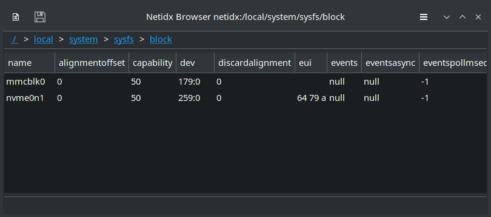

# Netidx System File Publisher

netidx-sysfs publishes the contents of small system files, such as
those found in sysfs and procfs, to netidx, and allows writing values
back subject to permissions. Because of the nature of sysfs and procfs
netidx-sysfs behaves in the following potentially unexpected ways,

- pure polling of structure and file contents, no use of
  e.g. inotify. This is because inotify either doesn't work at all, or
  only partly works on the target filesystems.
- linear backoff of polling frequency for both structure and files to
  reduce overhead for parts of the filesystem that don't change
  often. Maximum poll interval is currently 120 seconds, while the
  minimum is 1 second. Only a changed file will produce an update,
  even though it polls at least every 120 seconds no update will be
  produced if the file's contents didn't change.
- on demand polling for both structure and files. Only files that are
  subscribed are polled. Structure is only polled near subscribed
  files (e.g. directories are only read if they contain a subscribed
  file, or a recent attempt to subscribe to a file). As a result
  netidx-sysfs should consume no cpu time and only a little memory if
  it isn't being used.
- cross platform (unix, maybe windows). Does not use io uring or other
  patform specific apis, only tokio and std file operations.
- only reads the first 1k of each file, regardless of how big it
  is. Ideal for small files, tolerant of but maybe useless for large
  ones. Not at all limited to sysfs/procfs, just tailored to that use
  case.

## Setup

To setup `cargo install netidx-sysfs` and make sure you have a netidx
resolver either on the local machine or somewhere on the network. To
run, either run as a regular user, in which case you won't be able to
see everything, or run as root for full access. E.G.

```
# netidx-sysfs -a local -b local --netidx-base /local/system/sysfs --path /sys
```

will publish sysfs to `/local/system/sysfs`

Of course you are not limited to publishing locally, you could publish
every machine on your network's sysfs to netidx so you can read and
manipulate values over the network while enjoying strong encryption,
authentication, and authorization provided by netidx and your kerberos
v5 infrastructure.

## Browsing

Because the resolver and browser automatically infer table structure
from regular tree structure, many of the things in sysfs and procfs
will be automatically formatted as tables. For example, here is a look
at my `/sys/block`


